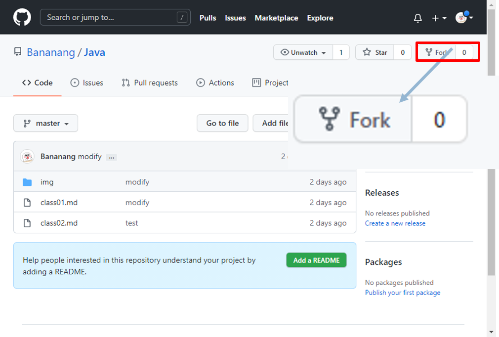
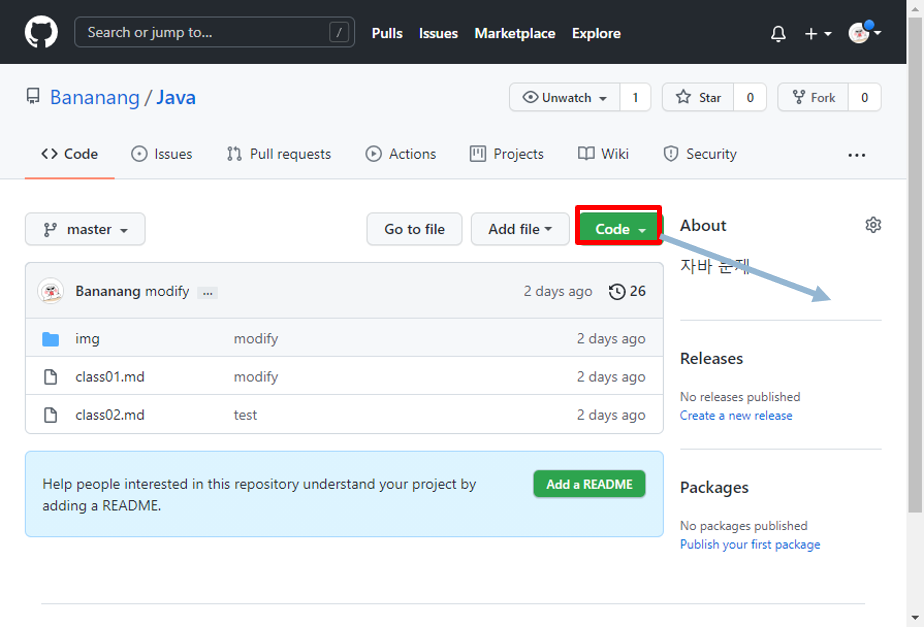

# md 확장자 파일 다운로드 
** 현재 깃허브에 올라와 있는 파일은 수업에 활용되는 파일입니다. 

-----------------------------------------------

### 깃허브 계정이 있다면
1. 화면 오른쪽 위에 있는 [Fork] 버튼을 클릭합니다.
2. 자신의 리포지토리에 복제된 소스를 사용하면 됩니다.

----------------------------------------------

### 깃허브 계정이 없거나 한꺼번에 다운로드하려면
1. 파일 목록 오른쪽 위에 있는 [Colone or download]를 클릭합니다. 
2. [Download ZIP]을 클릭합니다 파일명-master.zip 라는 파일이 다운로드됩니다.

----------------------------------------------
