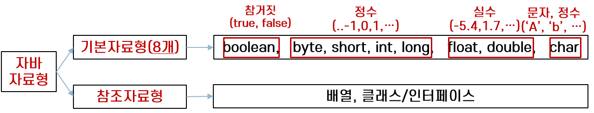

# Java 기초 정리

## 1. 기본

- 변수명: 숫자와 특수기호(`_`, `$`는 가능)가 맨 앞에 올 수 없다. 자바의 키워드가 변수명이 될 수 없음도 당연.

    ```
    abstract  continue  for         new        switch
    assert    default   goto        package    synchronized
    boolean   do        if          private    this
    break     double    implements  protected  throw
    byte      else      import      public     throws
    case      enum      instanceof  return     transient
    catch     extends   int         short      try
    char      final     interface   static     void
    class     finally   long        strictfp   volatile
    const     float     native      super      while
    ```

- 자료형: 변수를 처음 선언할 때 꼭 자료형을 명시해줘야 한다.
    + 숫자(Number): `int`, `long`, `double`, `float`, (`byte`, `short`도 있지만 거의 사용하지 않는다.)
    + 참, 거짓: `boolean`
    + 문자: `char`
    + 문자열 관련: `String`, `StringBuffer`
    + 배열: ArrayList
    + 해시: HashMap
- `+`, `-`, `/`, `%`는 다른 언어와 같은 기능이다. `++`, `--` 연산자 존재하고 변수 앞뒤로 붙는 결과가 다르다.
- 주석: `//`, `/* */` 형태로 사용한다. 모든 코드에 주석을 다는 것은 코드를 지저분하게 만들 뿐이므로 복잡한 부분에만 달도록 한다.
- `public` : 메소드의 접근제어자, public은 누구나 이 메소드에 접근할 수 있다는 의미
- `static` : 메소드에 static 이 지정되어 있는 경우 이 메소드는 인스턴스 생성없이 실행 할 수 있음을 의미
- and(`&&`), or(`||`), not(`!`)
- 값이 없는 것은 `null`
- 접근 제어자. 접근 범위 좁은 순이다.
    + `private`: 해당 클래스에서만 접근 가능
    + `default`: 해당 패키지 내에서만 접근 가능
    + `protected`: 해당 패키지 + 해당 클래스를 상속받은 외부 패키지의 클래스
    + `public`: 어디서든 접근 가능
    + 추가: 클래스 내의 클래스인 inner class에서도 접근 제어자 범위 적용된다.
- `final`: 상수 값이다. 선언한 값이 절대 변할 수 없다.

## 2. 자료형



- 기본 자료형  
  - 숫자와 boolean(true, false)을 나타내기 위한 자료형을 의미하며, 우리가 마음대로 추가로 만들 수 없음  

- 참조 자료형  
  - 기본 자료형을 제외한 모든 타입, 모든 클래스는 참조 자료형이라고 생각하면 됨

### 2.1 Number  

#### 2.1.1 정수형

- `int`: 범위는 -2147483648 ~ 2147483647
- `long`
    + 범위: -9223372036854775808 ~ 9223372036854775807
    + `long hi = 2131241414412L;` 형태로 숫자 맨 뒤에 대문자 L을 붙여줘야 함.

#### 2.1.2 실수형

- `double`: 실수를 표현할 때 디폴트 값
- `float`: `float hi = 3.234234f;` 처럼 맨 뒤에 f를 붙여준다.
- 지수 표현

    ```java
    double a = 123.45;
    double b = 1.2345e2;
    ```

- 8진수: 앞에 0이 붙으면 된다. `int a = 023;`
- 16진수: 앞에 0x가 붙으면 된다. `int a = 0xC;`

### 2.2 boolean

`true`, `false`로 표현

### 2.3 char

문자는 홑따옴표로 감싸주면 된다. 잘 쓰진 않는다고 한다.

```java
char a = 'a';   // a
char aa = 97;   // a
char aaa = '\u0061';    // a
```

### 2.4 String

- 생성자 2가지. 첫 번째 리터럴을 활용한 생성 방식을 추천한다. 가독성과 최적화 측면에서 더 좋다.
    + `String a = "aaa";`
    + `String a = new String("aaa");`
- `int`, `long`, `double`, `float`, `boolean`, `char`를 primitive type이라고 하고 리터럴을 활용해 값 세팅이 가능하다. 대신 new를 통한 생성은 불가능. String은 primitive type은 아니지만 예외적으로 리터럴을 활용한 생성이 가능한 것.
- `myString.equals(yourString)` : 문자열이 같은지 확인할 땐 `equals` 함수를 쓴다. `==`를 쓰면 리터럴이 아니라 new로 생성한 경우 변수가 가리키는 메모리 값을 비교하게 돼서 같은 문자열이지만 false가 나올 수 있다.

    ```java
    String a = "hello";
    String b = new String("hello");
    System.out.println(a.equals(b));    // 문자열 비교
    System.out.println(a==b);   // 메모리 주소 비교
    ```

- `myString.indexOf(subString)`: 어떤 문자열 내에서 특정 문자열 부분이 시작되는 인덱스를 알아낼 수 있다.

    ```java
    String a = "Hello Java";
    System.out.println(a.indexOf("Java"));
    ```

- `myString.replaceAll(str, repl);` : myString에서 str을 repl로 바꾼다.
- `myString.substring(start, end);` : 문자열에서 시작, 끝 인덱스의 문자열을 뽑아낸다. 끝 인덱스는 포함하지 않는다.
- `myStr.toUpperCase()`, `myStr.toLowerCase()`: 대소문자로 변경